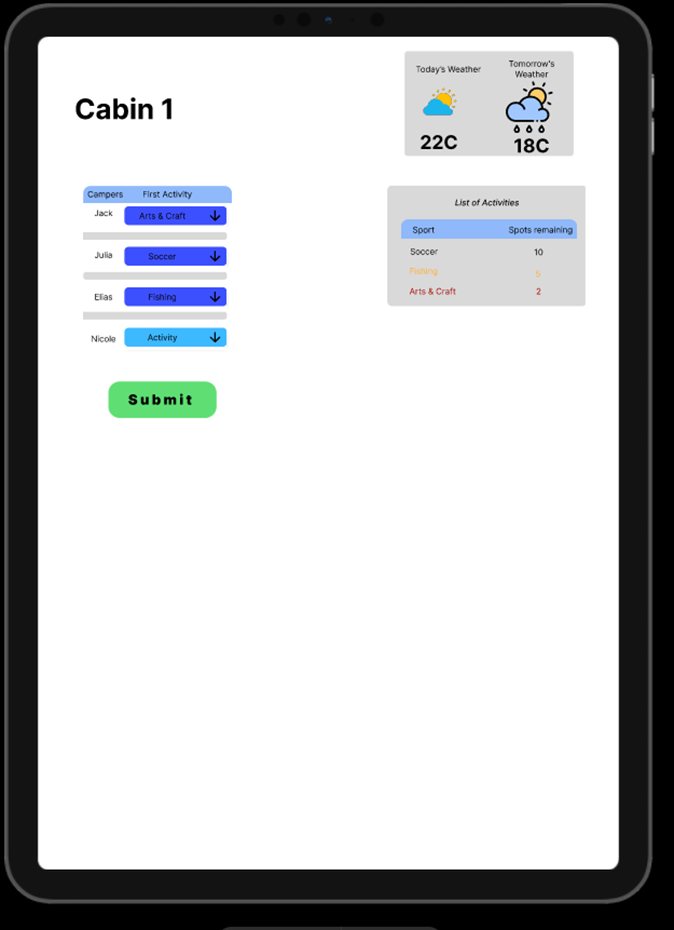
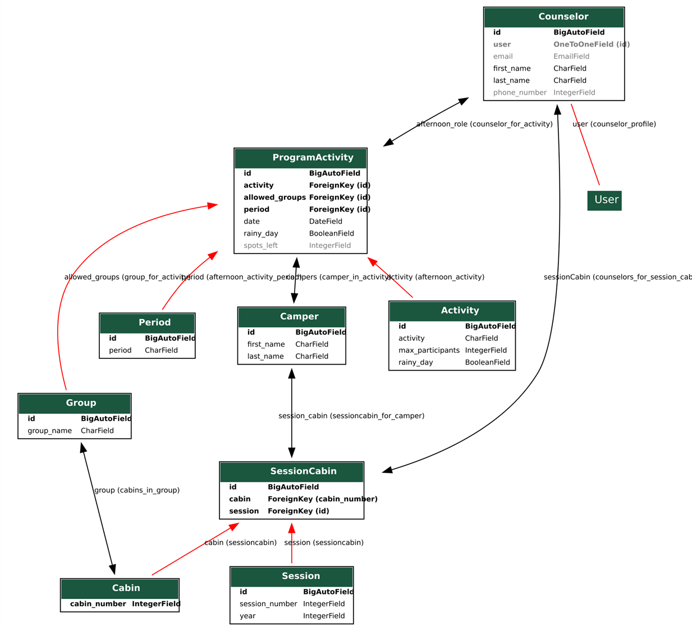
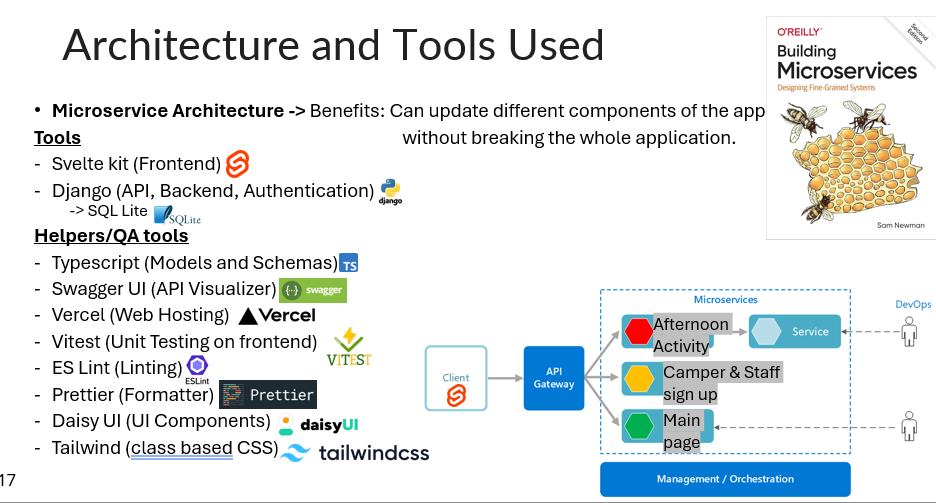

# Camp Activity Sign-Up System – Capstone Project Wiki
_Camper Activty signup system._

### Links to documentation
Link to WebUI Readme: https://github.com/Campstone/Webapp/blob/main/README.md
  Link to Webui UserManual: https://github.com/Campstone/Webapp/blob/main/UserManual.md

Link to backend readme: https://github.com/Campstone/Database-API/blob/main/README.md

## Requirements

> “A system that makes the life of the afternoon coordinator easy while pleasing as many campers as possible.”

### Functional Requirements

- The system shall allow counselors to quickly assign 20 campers to an activity.
- The system shall be able to handle 18 cabins that need to be signed up within 30 minutes.
- The system shall be accessible and easy for any afternoon program director to use.
- The system shall eliminate camper miscommunication between sign-ups and actual assignments.
- The system shall randomly assign cabin sign-up priority.

### Nice-to-Have Features

- The system could be mobile-friendly.

### Key Principles

- **Efficient**
- **Accessible**
- **Accurate**

---

## Meeting Minutes

### 🗓️ Jan 23, 2025
- Provide an overview of expectations from the school, client, and my side.
- Collected availability and goals from the client.
- Scheduled recurring meetings.

### 🗓️ Feb 7, 2025
- Presented different solutions with pros and cons of each and pitched what I thought worked best.
- Gathered more detailed requirements.
- Demonstrated an early Figma prototype.
- Started work on the database design.

### 🗓️ Feb 21, 2025
- Mapped out a day-in-the-life schedule of the camp.
- Discussed implementation in alignment with real camp workflow.
- Co-created an afternoon coordinator and counselor daily plan.
- _Helped clarify the intent behind requirements and allowed for idea exchanges._

### 🗓️ Mar 6, 2025
- Demonstrated a scalable database with Django admin where non-tech experts can use to create/view/edit data entries.
- Showcased automation features like when a counselor is created, an account with a username and password is automatically generated.
- Made critical fields undeletable to preserve logic.
- Added guidance notes and custom UI buttons on the admin page tailored to camp operations.

### 🗓️ Mar 20, 2025
- Showed a working UI with entry examples.
- Ensured mobile-friendliness and ease of use.
- Added dark mode for nighttime usability.
- Built user-friendly error pages for data issues.
- Optimized system performance.
- Collected feedback for future improvements.

> _Weekly meetings were also held with TA Omkar for guidance._
---

### 🗓️ Sep 20, 2025
- Reviewed notes from camp
- Reviewed what worked what didn't
- Updated requirements
- Gathered feedback
- Change the way we saw the problem. Had to come up with a new soluition/statagy
- Finished up the old implementation and any missing gaps it had.

### 🗓️ Oct 5, 2025
- Brainstomed and pitched a new solution
- Addressed concerns about camper data safety
- Needed to be revised.
- Started working on backend and frontend updates based off feedback.

### 🗓️ Oct 18, 2025
- Came up with a fix for concernacy based off ticketmaster and flightbooking system. No webhooks to keep it as offline as possible
- Stared working on the backend to implement these changes. Making new API endpoints and functions to keep funciallity with old cabin signup system.
- Looked into PWA (Progressive webapps) but realized that wont work with NFC tags on iOS
- Kept it as website.
- Did a code freeze and started to work on testing.

### 🗓️ Nov 2, 2025
- Started working on the Frontend to link to the new backend API endpoints.
- Decided to go with a QR codes instead of NFC tags as it would be easiler to implement and cheaper.
- Updated the backend accordingly.
- Updated the frontend 

### 🗓️ Nov 15, 2025
- Finilized the frontend and backend.
- Did some bug fixes.

### 🗓️ Nov 29, 2025
- Showed the full app to the client working UI with working database & api.
- Ensured conpatibility with mutiple devices at one time.
- Did the final presetation to the client.
- Optimized system performance.

> _Biweekly meetings were also held with TA Paul M for guidance._

---

## Contributions

### 👤 Joseph Mansour (Solo Developer)

- Requirements gathering  
- Planning & organization  
- Database design  
- API development  
- UI & UX design  
- Implementation  
- Figma prototyping  
- GitHub repo management  
- Testing & documentation  

---

## Challenges & Resolutions

- **Database design**: Had to ensure scalability and align with microservices.
- **Choosing the right system model**: Evaluated multiple ways of implementing the system before landing on the current one.
- **Delayed client communication**: Client was only available on a bi-weekly basis; used prototypes, pros and cons list, presentations to bridge the gap.
- **Understanding how the system would be used**: Created a detailed day schedule outlining when and how the afternoon coordinator and counselors would interact with the app during camp activities.
- **Tool unfamiliarity**: Learned Django, Figma, and database architecture from scratch.
- **Validation**: Invested time early in confirming direction to avoid wasted dev time.

> 🔁 Averaged ~15 hours/week

---

## First Semester Progress ✅

I’m very happy with the progress. Both me and the client are satisfied with where things stand. While working solo slowed development, it was a client requirement. I’ve laid strong backend and structural foundations, and future development will be fast and efficient.

---

## Second Semester Plan 🚀

Next term will focus heavily on frontend development. The admin and backend are solid; now the priority is counsellor interaction. I aim to complete the UI, integrate with the existing API, and simulate a real camp day.

Planned deliverables:
- Camper sign-up interface
- Activity roster views
- Admin tools to create/edit activities
- Usability testing with real camp schedules

---

## Designs & Diagrams

### 🖼️ Interface Concepts

### 🕒 Daily Schedule Breakdown

#### Camp Schedule

#### Afternoon Coordinator Schedule

#### Staff/Counsellor Schedule

#### All Together

> **In red:** Camp-T Counselor/CIT Schedule  
> **In gray:** Afternoon Coordinator Schedule  

### 🗄️ Database Design

### 🛠️ Architecture & Tools

### Final Achievements
 - Fully implemented a system that the camp can use to support 300+ campers
 - Revised the version after a real world implementation getting real feedback and modified what needs to change and what needs to improve.
 - Added concurrency allowing multiple campers to signup to activites at once.
 - Test diffrent senarios and made sure the app supports diffrent senarios it wasn't designed for, example if a camper has already submited there activites and decided to scan their qr code again.
 - Fully Offline so no internet is required to run this applicaiton.
 - Fully Mobile friendly
 - Drak mode for late night entires
 - Easy to use UI for campers and simple for counsollors and staff.
 - Implemented a timer to keep operations fast and campers moving.
 - Adding a new session/cabin/camper/activity... Anything! is super easy via the django admin page and no updates need to be done to the UI it will automaticlly be adjusted based off the backend.

### Deployment and Handover Plans
- I will be at camp and implementing it myself. If not I will set everything up remotly and be avalible as needed.
- Setup is really easy though all that you need to do is run the webui by doing `yarn run build` followed my `yarn run preview --host` and for the django backend `python3 manage.py runserver 0.0.0.0:8000`
- Having the database hosted and not using sql lite but postgress would be a better idea and probabily the only change you would have to do.
  
### Lessons Learned
- The first iteration of our system was not fast ennough and relied on counsollors handing papers and filling in the form in time.
- Was only able to do 1 cabin at a time.
- Solo development means you need to be very good independently as nobody is going to help you. Set key deadline to make sure you stay on track.
-   
