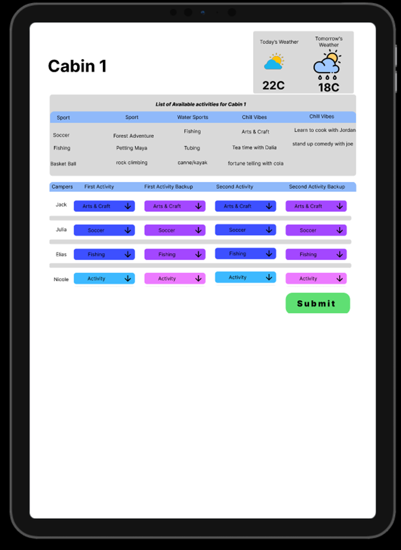

## Requirements

“A system that makes the life of the afternoon coordinator easy while pleasing as many campers as possible.”

-   The system shall allow counselors to quickly assign 20 campers to an activity.
-   The system shall be able to handle 18 cabins that need to be signed-up within the span of 30 min.
-   The system shall be accessible/easy for any afternoon program director to use.
-   The system shall make it so that campers have no miscommunication with what they sign up for and with what they get.
-   The system shall include a random priority assignment for which cabins get to sign-up first

### Nice-to-have

-   The system could be mobile friendly

### Key Principles

#### Efficient

#### Accessible

#### Accurate

### Meeting minutes

-   Spoke with the client on a weekly basis until we gathered enough requirements and established a plan we both liked. and started to meet bi-weekly as they preferred.

-   Spoke with the TA on a weekly basis.

## A summary wiki page explaining:

### How each member contributed (a table works).

-   All work was done by Me (Joseph Mansour)

### Summary of issues you have had to consider and resolve

-   Lots of database design decisions where considered to ensure easy development and scalability while following our Microservice architecture.
-   The type of system we are going to use was disused heavily
-   A plan on how the system would be used at the camp

-   ~15h a week _Lots of time was spent with the client solving scheduling issues and how the program would run. And learn about past solutions..._

### Have you achieved what you planned for the first semester?

I am very happy with how far I have come. Me and my client are both happy with the progress. I think with the help of other people development time might have been better, but the client required that it be a solo project. Ive made good progress with establishing strong fundamentals in my frontend, database, api and overall plan that progress might not seem like a lot but any future development will beadle to happen at a very high speeds.

### What is your plan for the second semester (one paragraph).

My plan for second semester is to get all of the frontend, api and database complete.
This term was very backend focused and using django's admin site to test things like adding campers... for next term I plan on doing more frontend focused development.

-   campers sign up page
-   list of activities with campers
-   admin page to add activities
-   test a typical days workload and schedule

Designs

schedule

**In red is the camp-T Counselor/CIT schedule*
**In gray is the Afternoon Coordinators schedule*
All of it all together

Database Design

